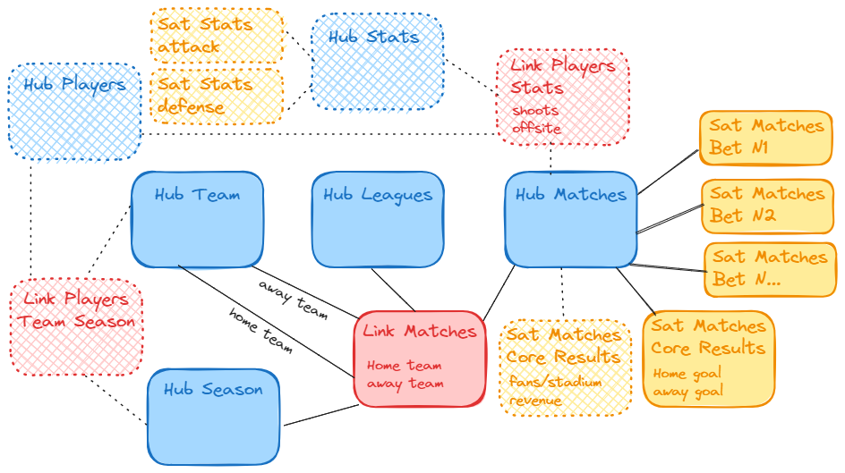

# Data Vault Football

## Introduction

This project demonstrates the implementation of the Data Vault architecture applied to football (soccer) data. The goal of this repository is to showcase the design and structure of scalable, flexible, and consistent data models using the Data Vault methodology, specifically for football data.

## Objectives

This repository demonstrates how the Data Vault methodology can be applied to the dynamic and complex nature of football data. The project highlights how Data Vault architecture can help ensure data consistency, scalability, and flexibility while supporting long-term growth and integration.

## Motivation

Data Vault is a modern data modeling methodology designed to handle large, complex datasets. It focuses on scalability, agility, and flexibility for building data warehouses. The primary components of Data Vault include:

- **Hubs**: Represent core business concepts (e.g., teams, players, matches).
- **Links**: Define relationships between hubs (e.g., player-to-team associations, match outcomes).
- **Satellites**: Store descriptive data and historical context (e.g., player stats, match events).

By utilizing Data Vault principles, this project provides a robust framework for managing football data while ensuring future scalability and easy integration of new data sources.

Key Highlights:

- Football Data Modeling: The repository includes Data Vault models designed to handle various football-related data, including match results, player performance, and team statistics.
- Scalable Architecture: The models are built to scale, ensuring that the system can grow as new football data sources are added over time.
- Flexible Data Pipeline: The project includes ETL (Extract, Transform, Load) processes to integrate raw football data into the Data Vault model.
- Data Consistency: The structure supports consistent and accurate tracking of football data over time, making it ideal for detailed analysis and reporting.

Check more on [Data Vault Model](assets/docs/data_model.md) documentation.

Additionally, football serves as a universally recognized "business model," providing an excellent context to demonstrate the practical applications of Data Vault concepts.

## Project Summary

### Technology Stack

To keep things simple, I won't use a Docker Compose stack with multiple systems like Postgres, Airflow, Streamlit, etc. Instead, I’ll focus on a streamlined approach to manage and analyze football data efficiently.

- `Python`: Used for data extraction, transformation, and loading (ETL) processes, as well as for scripting and automation tasks.
- `SQL Database`:
    - Using [SQLite](https://github.com/sqlite/sqlite) for transactional data (OLTP);
    - Using [DuckDB](https://duckdb.org/) for analytical data (OLAP) (not implemented);

Check [requirements.txt](requirements.txt) for a detailed list of installed libraries.

### Project Scope

Currently, I have successfully implemented one data source from Football Co. Future ideas include integrating additional sources such as Stats Bomb (among others not listed here).

1. [ :heavy_check_mark: ] [Football Co](https://www.football-data.co.uk/)
1. [  ] [Stats Bomb](https://github.com/statsbomb/open-data)
1. [  ] [openfootball](https://openfootball.github.io/) -- [GitHub](https://github.com/openfootball)
1. [  ] [this reddit comment](https://www.reddit.com/r/datasets/comments/z13mqh/comment/ix9uhvl/?utm_source=share&utm_medium=web3x&utm_name=web3xcss&utm_term=1&utm_content=share_button)
1. ... (among many others)

### Core Scripts & Flow

The core functionality of the project is encapsulated in three main scripts, each serving a specific role in the data extraction, loading, and transformation processes. Below is an overview of each script and its key features.

| 1 - `extractor.py`

This script is responsible for downloading and saving football match data from various European leagues in CSV format. The downloaded data is stored in CSV files, which are then available for further processing. It ensures efficient data management through concurrent downloads and file updates.

| 2 - `loader.py`

This script loads football match data from CSV files into a DuckDB database. It processes multiple files concurrently and stores the data in tables named after the country, season, and league. The script also ensures that necessary columns like country, season, and league are added to each table if they are missing.

| 3 - `to_dv.py`

The script is part of the data processing pipeline that extracts football-related data, transforms it, and loads it into a Data Vault for further analysis. It processes football match data, creating hashes for teams, leagues, seasons, and matches, and stores them in corresponding hub tables. Additionally, it populates satellite tables with match results, statistics, and odds from multiple sources, including Bet365 and SportingBet. The script uses DuckDB for querying, and CSV files are generated locally for each table, which are later batch-loaded into a database.

The main function uses multithreading to process data tables concurrently, allowing for efficient handling of large datasets. It starts by renaming columns to standardize naming conventions, adds necessary computed columns (such as hash keys), and saves the transformed data to CSV files. The script then logs the start and completion of each process, while also handling errors and generating detailed log files for tracking. It also includes logic to normalize season formats for consistency.

The batch loading process follows the data transformation phase, where CSV files are read and loaded into the appropriate tables in the database. The process uses conflict resolution strategies, such as ignoring duplicates for hub tables and comparing hash differences for satellite tables, ensuring that only new or updated records are stored. The script is designed for scalability, supporting the integration of additional data sources and expanding the Data Vault schema as needed.

#### Future Ideas

1. **Expand Data Sources**: Incorporate additional data sources to increase the volume and diversity of football data.
2. **Build a Data Warehouse**: Develop a comprehensive data warehouse using Data Vault architecture to centralize and manage football data effectively.
3. **Enhance Data Quality and Cleansing Processes**: Implement robust data quality checks and cleansing procedures within your Data Vault to ensure high data integrity and reliability.
4. **Use Dolthub as the Primary Database**: Explore the [Dolthub](https://www.dolthub.com/) feature to expose the current database (including a CI that updates daily).
5. **Apply Data Vault to Olympic Data**: Explore applying Data Vault principles to manage and analyze data from the Olympics, leveraging similar architectural benefits.

## Data Model

Integrating **Data Vault** principles with football data presents an intriguing challenge and opportunity for data engineering enthusiasts. By adopting a Data Vault approach, we can leverage its robust methodology to effectively organize, manage, and analyze the wealth of football-related information available.

In the context of football data, the key lies in identifying the core entities and relationships that define the sport's ecosystem. Teams, players, matches, and other relevant entities form the foundation of our data model. Each entity represents a distinct aspect of football, and by treating them as hubs within the Data Vault framework, we establish a solid structure for organizing our data.

Links play a crucial role in connecting these entities and capturing their relationships. For example, the Team-Player Link establishes the association between teams and players, allowing us to track player rosters for individual teams over time. Similarly, the Match-Team Link connects matches with participating teams, enabling us to analyze team performance and match outcomes easily.

Satellites complement hubs and links by providing additional context and detail to our data. In the case of football data, satellites capture pertinent attributes and statistics related to teams, players, and matches. This rich repository of information facilitates in-depth analysis, trend identification, and historical tracking, empowering analysts and enthusiasts to derive meaningful insights from the data.

**The normalization of the data across all the hubs, links, and satellites plays a central role when it comes to the multiple sources.** A good example is a team name that is identical in two countries or even a season such as 12-13 or 2012/2013, which means the same.

Overall, integrating Data Vault principles with football data offers a structured and scalable approach to data management and analysis in the world of sports. By adopting this methodology, we can unlock new possibilities for understanding player dynamics, team strategies, match outcomes, and other facets of the beautiful game.

Below is a schema showcasing the structure of the Football Data Vault model:

This screenshot provides a visual representation of the entities, relationships, and attributes within the Data Vault model, offering insights into its design and organization.

The blocks marked with hashtags are for future ideas.

## Data Sources

In the world of football data, acquiring reliable and comprehensive data sources is essential for building a robust Data Vault model. These sources include official football leagues, sports statistics websites, and data APIs.

For example, official football leagues often provide access to match results, team rosters, and player statistics through their websites or APIs. Sports statistics websites aggregate data from multiple sources and provide comprehensive datasets covering various aspects of the game, including player performance metrics, match statistics, and historical data.

Additionally, specialized data providers offer access to niche datasets and analytics tools tailored specifically for football analysis. These resources can include advanced player tracking data, tactical insights, and predictive analytics models.

By leveraging a combination of these data sources, we can ensure the completeness, accuracy, and relevance of the football data used in our Data Vault model. This diverse range of sources enables us to capture the full spectrum of football-related information and unlock valuable insights for analysis and exploration.

Check more on [Data Sources](assets/docs/data_sources.md) documentation.

## References

Here are some references that helped me understand the Data Vault architecture:

1. [[Post] - Practical Introduction to Data Vault Modeling](https://medium.com/@nuhad.shaabani/practical-introduction-to-data-vault-modeling-1c7fdf5b9014)
1. [[Post] - Data Vault Part 1 - Introduction](https://bitpeak.pl/dv-1/)
1. [[Post] - Data Vault Part 2 - Data Modeling](https://bitpeak.pl/dv-2/)
1. [[Post] - The Business Data Vault](https://vertabelo.com/blog/data-vault-series-the-business-data-vault/)
1. [[YouTube] - Understanding Data Vault 2.0](https://www.youtube.com/watch?v=y7faBrUcb74)
1. [[YouTube] - Introduction to Data Vault Modeling with Hans Hultgren](https://www.youtube.com/watch?v=IQUYELrPKlw)
1. [[YouTube] - Data Warehouse Modeling Using Data Vault 2.0 in Fintech Companies | Alumni Talks 2023](https://www.youtube.com/watch?v=qtQ42HxB_Sg)
1. [[YouTube] - MASTERCLASS: Demystifying Data Vault](https://www.youtube.com/watch?v=whGVZF1amI8)
1. [[YouTube] - DataVaultAlliance Channel](https://www.youtube.com/@DataVaultAlliance)
1. [[YouTube] - Data Vault Academy Channel](https://www.youtube.com/@DataVaultAcademy)
1. [[YouTube] - Datavault Channel](https://www.youtube.com/@Datavault)

Among many others.
